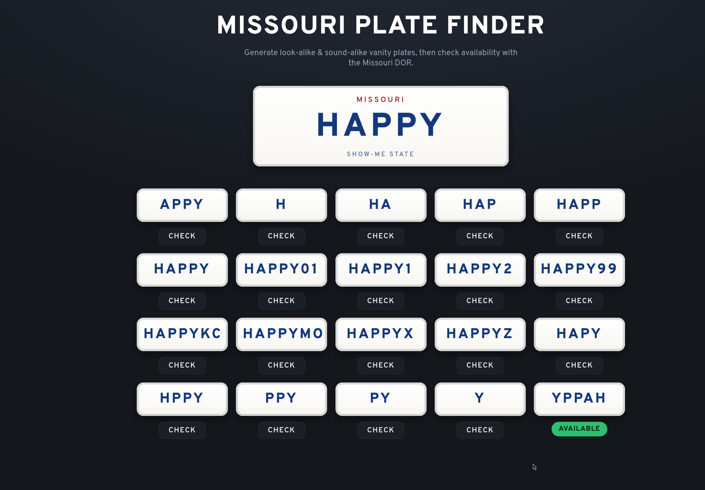

# Missouri Plate Finder

This web application generates candidate license plates and checks their availability with the Missouri Department of Revenue.



## Features

- Generates candidate vanity plates from an input string in the browser.
- Checks plate availability through an HTTP backend service.
- Displays candidate plates in a responsive grid.

## System Architecture

1. The Elm frontend runs in the browser. It generates candidate variations and sends check requests.
2. The OCaml backend accepts check requests. It queries the Missouri Department of Revenue search service and returns availability status.
3. The backend limits the request rate to prevent upstream blocks.

## Candidate Generation

The frontend applies these rules to the input string:

- `normalize`: Converts characters to uppercase and removes non-alphanumeric characters.
- `reverse`: Reverses the string.
- `truncate`: Creates substrings from the left and right sides.
- `dropAny`: Removes each character one at a time.
- `padSimple`: Adds common suffixes and limits length to seven characters.

The [mo-custom-plate-finder](https://github.com/am5083/mo-custom-plate-finder) OCaml library supports more variation strategies. This frontend implements only a subset of those strategies.

## Build and Run

### Prerequisites

- Elm 0.19.1
- OCaml 5.x and Dune (optional, for backend development)

### Frontend

1. Start Elm reactor:
```sh
elm reactor
```

2. Open `http://localhost:8000/index.html` in your web browser.

3. To build the production bundle, run:
```sh
elm make src/Main.elm --optimize --output=elm.js
```

### Backend

1. Build the backend:
```sh
dune build
```

2. Start the backend server:
```sh
dune exec server/main.exe
```

3. To connect the frontend to the local backend, open:
```text
http://localhost:8000/index.html?api=http://localhost:8080
```
